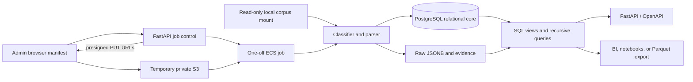

# CBOM Catalog

CBOM Catalog turns the heterogeneous service-group files in a selected corpus
root into one searchable,
provenance-preserving PostgreSQL catalog. It is designed to run unchanged on a
laptop with Docker Compose, in a container platform, or against a managed
PostgreSQL service.

The Compose ingester opens the source corpus through a read-only mount. Exact
bytes are identified by SHA-256; each source collection and relative path remains
a separate provenance record even when two paths contain the same document.
Refreshes verify that checksum against the database before parsing, and retain
every checksum ever observed for each source path.

## What is in the current corpus

The current 2026-09-18 source snapshot contains 534 JSON files (~160 MiB) in 35
populated input folders. Approved aliases are canonicalized into a catalog that
retains 40 service-group categories, including five approved no-data coverage
groups:

| Input | Count | Notes |
|---|---:|---|
| CycloneDX 1.6 | 533 | The main SBOM/CBOM representation |
| CycloneDX 1.7 | 1 | Includes services, annotations, dependencies, and crypto properties |
| Other source formats | 0 | The older snapshot still demonstrates SPDX, OSCAL, FIPS-report, CSV, and summary parsers |

The root-cause analysis for the earlier mixed-format view and the independent
current/target-module evidence model are in
[`docs/CLAIM_EVIDENCE_AND_PROVENANCE_2026-09-21.md`](docs/CLAIM_EVIDENCE_AND_PROVENANCE_2026-09-21.md).

No CycloneDX 1.5 document and no substantive Snyk enrichment field is present in
this snapshot. The parser accepts CycloneDX 1.5 and generic/custom properties so
those inputs can be added later without changing the core model.

The refreshed database contains 533 unique current documents, 341 artifacts,
59,263 canonical components, 282,688 document-scoped component occurrences,
198 relationship edges, and one exact duplicate content pair. The latest
authoritative refresh verified all 534 paths: 507 were checksum-unchanged, 14
were loaded, 13 were relinked to known content, and none failed.

See [Corpus inventory](docs/CORPUS_INVENTORY.md) for the full mapping and known
anomalies.

## Architecture



PostgreSQL is the canonical store because the workload mixes relational identity,
many-to-many provenance, JSON extensions, and dependency graphs. Recursive CTEs
cover current graph queries. DuckDB/Parquet is a useful downstream analytical
copy, while a dedicated graph database should remain an optional derived view.

## Quick start with Docker

Prerequisites: Docker with Compose and enough free space for PostgreSQL indexes
and optionally a second copy of the raw JSON. The host-only inventory and test
commands additionally require Python 3.11 or newer.

```bash
cd cbom-catalog
cp .env.example .env
docker compose up -d postgres
docker compose run --rm migrate
docker compose --profile tools run --rm ingest
docker compose --profile tools run --rm target-modules
docker compose --profile tools run --rm target-public-evidence
docker compose --profile tools run --rm target-catalog-evidence
docker compose up -d --build api web
```

Then open:

- Next.js CBOM Workbench: <http://localhost:3000>
- Legacy workbench rollback surface: <http://localhost:8000/ui/>
- API documentation: <http://localhost:8000/docs>
- Health check: <http://localhost:8000/healthz>
- Catalog summary: <http://localhost:8000/api/v1/stats>

The primary workbench is a separate production-built Next.js container. It uses
a same-origin server proxy to the private API, so browsers never receive the
internal API token or database address. The FastAPI `/ui/` application remains
a legacy rollback surface. See the [first-run guide](docs/FIRST_RUN.md) and
[web application guide](docs/WEB_APP.md).

The equivalent shortcuts are `make up`, `make ingest`, and `make logs`.

The default password is for local development only. Change every value in `.env`
before exposing PostgreSQL or the API outside the machine. PostgreSQL is bound to
`127.0.0.1:55432` by default to avoid colliding with a host installation; override
`POSTGRES_PORT` when needed. The API is likewise bound only to
`127.0.0.1:${API_PORT:-8000}`.

## Inventory without a database

The inventory command uses only the Python standard library and does not mutate
the corpus:

```bash
PYTHONPATH=src python -m cbom_catalog.cli inventory ../SSE_CBOMS --pretty
```

It reports service-group counts, detected formats and versions, component types,
property namespaces, exact-content duplicates, and invalid/empty inputs.

## Ingestion behavior

```bash
cbom-catalog ingest /data/SSE_CBOMS
```

Important behavior:

- Every refresh reads each file once to calculate SHA-256. If the collection,
  path, algorithm, checksum, and linked document are unchanged, parsing and all
  normalized-data writes are skipped.
- `source_file` stores the current checksum; `source_file_fingerprint` stores the
  immutable checksum history with first/last run and observation count.
- A file that changes at the same path is parsed into a new immutable `document`,
  while its previous checksums and documents remain available for audit.
- An exact SHA-256 match links the new source path to the existing document.
- A changed file at the same path is linked to a new immutable document.
- Unknown JSON is retained as an `external_record` and flagged, not discarded.
- Raw parsed JSON is stored by default. When using `CBOM_STORE_RAW_JSON=false` or
  `--no-raw-json`, a stable `CBOM_SOURCE_URI`/`--source-uri` is required so the
  exact bytes still have an external authority.
- `--collection` supplies a stable logical source name, so the same relative path
  and service-folder name can exist independently in multiple corpus roots.
- All custom component properties remain in occurrence JSONB. Query-friendly
  property rows are also created, except high-cardinality `syft:location:*`
  properties. Use `--include-location-properties` to expand those too.
- One transaction is used per file, so a malformed input cannot leave a partial
  document. Errors are written to `ingest_issue` and the run continues unless
  `--fail-on-error` is supplied.
- Use `--force-reprocess` to rerun parser validation on unchanged bytes. Exact
  documents and existing normalized facts remain immutable; rebuild into a new
  database when mapping logic changes materially.

The default Compose ingestion command is therefore also the normal refresh:

```bash
docker compose --profile tools run --rm ingest
```

Its JSON result includes `files_unchanged`; those files were hashed and verified
but never parsed again.

Cloud additions use the asynchronous administrator ingestion API instead of a
bind mount. The client submits a canonical checksum manifest, uploads bytes
directly to temporary private S3 through checksum-bound presigned URLs, and
submits a one-off ECS task. The task revalidates every SHA-256 before either a
non-mutating comparison (`dry_run=true`) or the existing checksum-gated ingest.
FastAPI never receives the raw corpus synchronously. See
[Ingestion and assessment intelligence](docs/INGESTION_AND_ASSESSMENT.md) for
the protocol and supplied client.

## Query surfaces

The API supports:

- `/api/v1/dashboard/overview` for collection/service-group scoped metrics,
  format coverage, component types, and service-group distributions
- `/api/v1/documents`, `/api/v1/documents/{id}`, and
  `/api/v1/documents/{id}/components` for paginated per-document inventory with
  optional text and explicit-crypto filters
- `/api/v1/inventory/documents` and `/api/v1/inventory/libraries` for counted,
  server-filtered pages used by the Next.js workbench
- `/api/v1/inventory/service-groups` and
  `/api/v1/inventory/service-groups/{collection}/{group}` for the accountability
  register and service drawer
- `/api/v1/source-collections` and `/api/v1/service-groups`
- `/api/v1/fingerprints` and `/api/v1/ingest-runs`
- `/api/v1/admin/ingestion/batches` to list/create manifest-backed jobs and
  `/api/v1/admin/ingestion/batches/{id}` for status/results
- `/api/v1/admin/ingestion/batches/{id}/submit` to launch the asynchronous ECS
  task and `/api/v1/admin/ingestion/batches/{id}/logs` for bounded task output;
  these routes require active-admin `ingestion:read`/`ingestion:write` scopes
- `/api/v1/components` and `/api/v1/components/{id}/usage`
- `/api/v1/artifacts`
- `/api/v1/dependency-documents` and
  `/api/v1/documents/{id}/dependency-graph`
- `/api/v1/dependency-closure`
- `/api/v1/external-records`
- `/api/v1/issues`
- `/api/v1/fips/assessment` for deterministic, evidence-backed FIPS 140-3
  transition candidate findings and service-group coverage; findings are opt-in
  and POA&M candidates are server-paginated
- `/api/v1/fips/team-milestones` for the reviewed Team Tracker crosswalk,
  owner/lead fields, raw IL2/IL5 planning values, and immutable source metadata
- `/api/v1/fips/poam.csv` for deduplicated draft POA&M candidates
- `/api/v1/fips/poam-workstreams.csv` and
  `/api/v1/fips/compliance-package.zip` for reviewed handoff packages

Document, component, artifact, external-record, and service-group searches accept
`source_collection`; combine it with `service_group` to select one provenance
scope when several collections contain the same folder name.

Dependency closure follows only `DEPENDS_ON` by default. Pass repeated
`relationship_type` parameters for an explicit typed traversal; SPDX `CONTAINS`
and `DESCRIBES` edges are never silently treated as package dependencies.

Direct SQL is the richer interface. Start with the
[query cookbook](docs/QUERY_COOKBOOK.md) or [`examples/queries.sql`](examples/queries.sql).

## Project layout

```text
cbom-catalog/
├── db/                         Ordered PostgreSQL migrations and runner
├── docs/                        Corpus, mapping, model, query, and operations docs
├── examples/queries.sql         Ready-to-run investigation queries
├── scripts/                     Snapshot and admin-ingestion clients
├── src/cbom_catalog/            Parser, inventory, ingestion/jobs, API, and legacy UI
├── tests/                       Synthetic and real-corpus parser tests
├── Dockerfile
└── docker-compose.yml
```

## Design documentation

- [Documentation index](docs/README.md)
- [First run](docs/FIRST_RUN.md)
- [Ingestion and assessment intelligence](docs/INGESTION_AND_ASSESSMENT.md)
- [Database snapshot sharing](docs/DATABASE_SNAPSHOTS.md)
- [Release checklist](docs/RELEASE_CHECKLIST.md)
- [Corpus inventory](docs/CORPUS_INVENTORY.md)
- [Format mapping](docs/FORMAT_MAPPING.md)
- [Data model](docs/DATA_MODEL.md)
- [Query cookbook](docs/QUERY_COOKBOOK.md)
- [Operations and cloud deployment](docs/OPERATIONS.md)
- [Web application](docs/WEB_APP.md)
- [FIPS 140-3 transition assessment](docs/FIPS_140_3_ASSESSMENT.md)
- [Draft POA&M export](docs/POAM_EXPORT.md)
- [FedRAMP assessor specialist](docs/FEDRAMP_ASSESSOR_AGENT.md)

## Validation

After installing the project dependencies (`python -m pip install -e .`), run:

```bash
PYTHONPATH=src python -m unittest discover -s tests -v
```

The test suite includes checksum refresh behavior, asynchronous manifest/job
validation, scoped admin-ingestion authorization, API query regressions,
synthetic CycloneDX 1.5 and SPDX 2.3 inputs, plus real samples from CNHE, LANDERS,
FROUTER, ZTA-BAP, and ZTA-CALP.

The container build, idempotent re-ingestion, PostgreSQL migrations, full-corpus
ingestion, API health, statistics, component search, issue reporting, and FIPS
record endpoints were also exercised against the workspace corpus.
The retained [2026-09-17 validation record](docs/ingestion-validation-2026-09-17.json)
describes the older mixed-format snapshot. New database exports carry their own
`.manifest.json` with current migrations, ingest metadata, and counts.

“Successfully parsed” is not the same as official CycloneDX/SPDX/OSCAL JSON Schema
conformance. The importer is intentionally tolerant of producer extensions and
records structural warnings; add a separate schema-validation gate if strict
standards certification is required.
