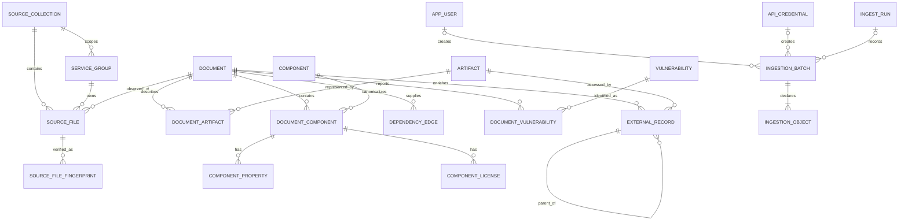

# Data model

## Relationship overview

## Three identity levels

The model deliberately separates identities that are often conflated:

1. A `source_file` is where an observation was found inside a stable
   `source_collection`. Folder ownership and the filename are provenance, not
   canonical identity.
2. A `document` is an immutable byte payload. SHA-256 deduplicates exact copies,
   while all source aliases remain visible.
3. An `artifact` is the subject being analyzed. Its key prefers OCI digest, then
   PURL, then CPE, then a normalized name/version fallback.

Components have the same distinction. `component` is a cross-document identity;
`document_component` is what a particular BOM actually asserted, including its
`bom-ref`, properties, hashes, evidence, and crypto details.

`source_file` is unique by `(source_collection_id, source_path)` and also records a
source URI. This prevents a second corpus with `CNHE/foo.json` from overwriting the
first corpus's provenance.

The current SHA-256 is stored on `source_file`. `source_file_fingerprint` is the
append-only history keyed by source path, algorithm, and checksum. It records byte
size, first/last ingest run, verification timestamps, and observation count. A
refresh must pass this checksum gate before it can be classified as unchanged.
The gate also verifies that a linked document has the same checksum; a mismatch is
recorded as an issue and reprocessed instead of being silently skipped.

`service_group` is likewise unique by `(source_collection_id, slug)`. A folder
named `CNHE` in two source collections creates two scoped groups; APIs can filter
by both values, while exact documents and canonical components may still dedupe
across those collections.

Migration 015 idempotently retains the approved empty SSE planning categories,
including `on-prem-clients`, in existing databases. The ingester enforces the
same collection-scoped list on every complete or incremental SSE refresh. These
zero-document rows are coverage requests, not synthetic evidence records.

## Operational ingestion control plane

Migration 014 adds job metadata under the private `app_auth` schema without
turning uploaded source bytes into database records:

- `app_auth.ingestion_batch` stores the source collection, canonical manifest
  SHA-256, dry-run/authoritative flags, expected and verified counts, temporary
  S3 prefix/expiry, state/timestamps, ECS task ARN, optional `ingest_run` link,
  bounded result/error data, and exactly one creating user or API credential.
- `app_auth.ingestion_object` stores each normalized relative path, private S3
  object key, expected SHA-256/size/content type, optional source modification
  time, and verification timestamp.

The object rows are a checksum manifest, not a raw-corpus archive. Job workers
download to ephemeral storage and revalidate bytes before parsing. Shared
catalog snapshots exclude all of `app_auth`, so identities, credentials,
overlays, audit events, and ingestion-job metadata remain environment-local.

## Canonical component identity

Identity preference is:

1. exact PURL;
2. exact CPE;
3. hash of type + namespace/group + case-folded name + exact version.

The identity key is hashed and unique. PURL text is not blindly lowercased because
some package ecosystems have case-sensitive path semantics. Missing PURLs are
expected for files, certificates, algorithms, and application subjects.

## Evidence and time

Facts from a BOM occurrence are never overwritten by a summary or assessment.
OSCAL results, FIPS checks, scan indexes, CSV curation, and future Snyk/library
enrichment live in `external_record` with provider, observed time, artifact link,
and raw data. OSCAL observations/findings/risks also point to their parent result.
This makes disagreement and evidence hierarchy queryable instead of hiding them.

External records carry a canonical payload SHA-256 and use an immutable
document/type/provider-ID/payload identity. Reprocessing the same evidence is a
no-op; changed evidence becomes another observation rather than overwriting the
earlier payload.

The v0.1 schema stores source modification time and ingest-run time. When a future
provider supports validity intervals, add `valid_from`, `valid_to`, and a content
hash to its external records rather than updating old evidence in place.

## JSONB versus normalized columns

Frequently joined/searchable fields are relational and indexed: service group,
format/version, artifact identity, package identity, dependency refs, property
name/value, license, and vulnerability ID.

Producer-specific or rapidly changing structures remain JSONB. This includes raw
documents, arbitrary properties, crypto details, evidence, ratings, OSCAL content,
and unknown fields. The combination allows forward compatibility without turning
every query into a full-document JSON scan.

## Built-in views

- `v_document_inventory`: one exact document with all source aliases and
  collection-qualified groups.
- `v_component_usage`: canonical component with document count and
  collection-qualified groups.
- `v_format_coverage`: unique document/source/component counts by kind and version.
- `v_duplicate_source_content`: documents observed at multiple source paths.
- `v_source_fingerprint_status`: current checksum, linked document checksum,
  checksum-version count, and verification history per source path.

## Deliberate non-decisions

- No deployment identity is inferred solely from a filename.
- A tag is not treated as immutable; an OCI digest wins when present.
- Missing dependencies are not interpreted as “no dependencies.”
- Summary counts do not replace counts calculated from their source documents.
- A graph database is not required for the current scale. It can be generated as
  a read model later if multi-hop graph traffic justifies the extra system.
